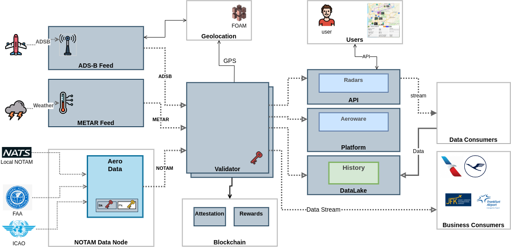
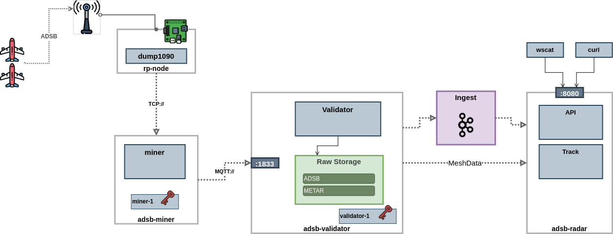

# Aeroware

Aviation Platform Research

1. [__aw-core__](aw-core)               - Core Entities and Objects
2. [__aw-aircraft__](aw-aircraft)       - Aircraft (icao spec)
3. [__aw-gamet__](aw-gamet)             - GAMET tools
4. [__aw-adsb__](aw-adsb)               - ADS-B tools
5. [__aw-gpx__](aw-gpx)                 - GPX tools
6. [__aw-nft__](aw-nft)                 - Experiments with NFT as Aeroware entity (Plane, License)
7. [__aw-geo__](aw-geo)                 - Geo snippets
8. [__aw-lake__](aw-lake)               - Datasets (ICAO Aircrafts DB,...)

---

## Archticture

### Aeroware Mesh

High Level Overview

---

### PoC

Simple Topology:

[__adsb-miner__] --[MQTT]--> [__adsb-validator__] --[file]--> [__adsb-radar__] <--[http]-- [__wscat__]

 

See [aw-adsb/README.md]() for details

----

## Credits

I'm trying to credit all libs and inspiration projects (where I study code or architecture and reimplement). If something is missing, I will update immediately at request

- Fast Parser: [https://github.com/com-lihaoyi/fastparse](https://github.com/com-lihaoyi/fastparse)
- Bits Parser: [http://scodec.org/](http://scodec.org/) 
- XML Bindings (sbt plugin): [https://scalaxb.org/running-scalaxb](https://scalaxb.org/running-scalaxb)
- XML streaming: [https://www.scalawilliam.com/xml-streaming-for-scala/](https://www.scalawilliam.com/xml-streaming-for-scala/)
- dump1090: [https://github.com/antirez/dump1090](https://github.com/antirez/dump1090)
- Flightaware: Most inspiring project [https://github.com/flightaware/dump1090/blob/master/tools/README.aircraft-db.md](https://github.com/flightaware/dump1090/blob/master/tools/README.aircraft-db.md)
