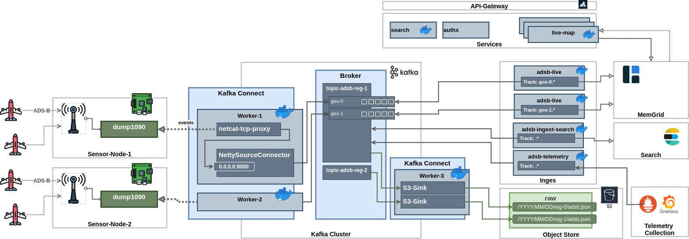
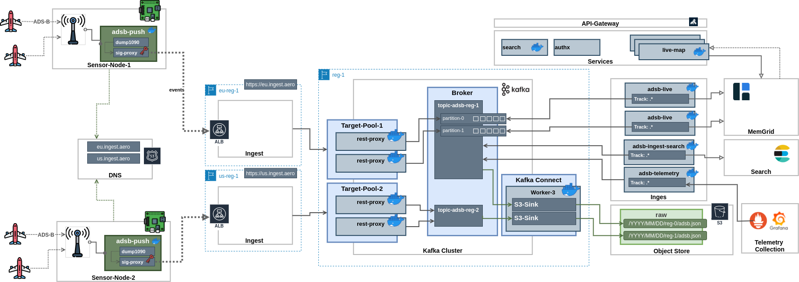

# ADS-B

## Components

1. [adsb-core](adsb-core) - ADSB parser
2. [adsb-ingest](adsb-ingest) - Ingestion from RP sensors
3. [adsb-tools](adsb-tools) - Shell tools to work with ADS-B data
4. [adsb-view](adsb-view) - Map viewer
5. [adsb-proxy](adsb-proxy) - simple dump1090 proxy

## Kafka Artchitecture Examples

Reference architecture examples. Lots of tecnical details and nuances are not depicted.

Design is based on __skel-ingest__ ideas and ruminations

----

### Cloud Ingestion with Private ADS-B feed sensors

Reference Architecture for small number of ADS-B Feeders (outbound feeds) based on Raspberry Pie dump1090

No customization is needed on RP side. All ingestion flow is handled by Kafka Cluster

Kafka Source Connectors (all inbound)

- [https://github.com/vrudenskyi/kafka-connect-api-clients](https://github.com/vrudenskyi/kafka-connect-api-clients)
- [https://www.confluent.io/blog/push-or-pull-data-into-kafka-connect](https://www.confluent.io/blog/push-or-pull-data-into-kafka-connect)
- [https://github.com/dhanuka84/kafka-connect-tcp](https://github.com/dhanuka84/kafka-connect-tcp)

----

 

### Geo-distributed Decentralized Cloud Ingestion

Reference Architecture for Geodistributed, decentralized ingestion for a very large number of ADS-B producers.

Raspberry Pie uses __sig-proxy__ component is used for flow transformation (inbount to outbound) and private fields inclusion and signing

 

----

## Resources and Credits

ADS-B: [https://en.wikipedia.org/wiki/Automatic_Dependent_Surveillance%E2%80%93Broadcast](https://en.wikipedia.org/wiki/Automatic_Dependent_Surveillance%E2%80%93Broadcast)
High Precision ToA: [https://github.com/openskynetwork/dump1090-hptoa](https://github.com/openskynetwork/dump1090-hptoa)

