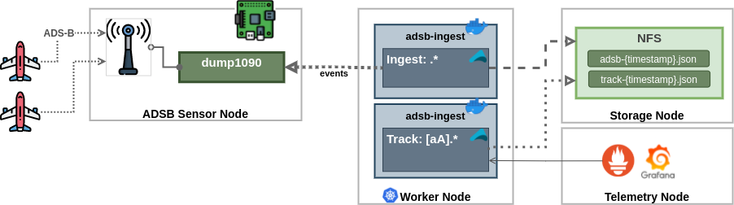
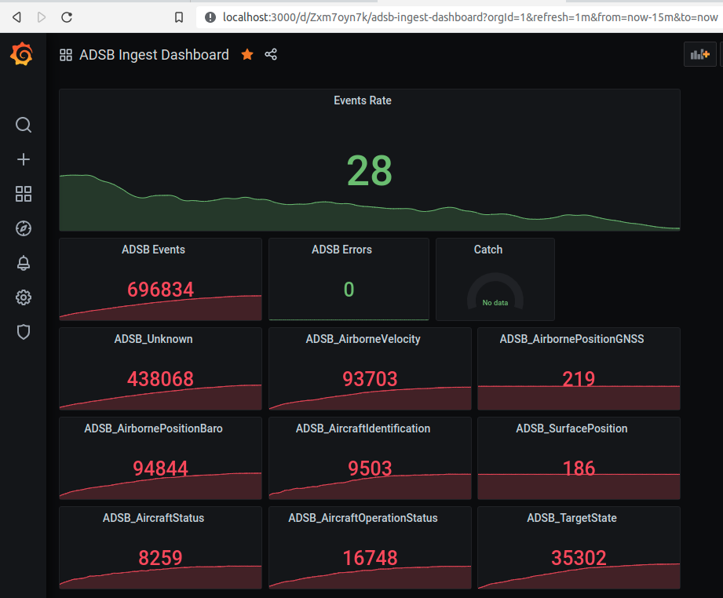

# adsb-ingest

Ingest ADSB events from __dump1090__ (Raspberry)

This reference architecture for PoC/Testing



<br>

### Cli example

Show all ADSB messages to console
```
./run.sh --dump1090-host=rp-1 --dump1090-port=30002 --aircraft='.*' -f=NONE
```

Track Antonov and Airbus and write to CSV file
```
./run.sh --dump1090-host=rp-1 --dump1090-port=30002 --aircraft='[aA].*' -f='A-{yyyy-MM-dd_HH:mm:ss}.csv'
```

### Output Example tracking Мрія:

```
Track: ADSB_AirborneVelocity(17,5,AircraftAddress(508035,Antonov An-225 Mriya,UR-82060),8D508035990443110080024D6ED7)                                                                                            
Track: ADSB_AirbornePositionBaro(17,5,AircraftAddress(508035,Antonov An-225 Mriya,UR-82060),8D508035580F119C4E5F5922868F)                                                                                        
Track: ADSB_AirbornePositionBaro(17,5,AircraftAddress(508035,Antonov An-225 Mriya,UR-82060),8D508035580F119C365F575EB0AD)                                                                                        
Track: ADSB_AircraftIdentification(17,5,AircraftAddress(508035,Antonov An-225 Mriya,UR-82060),4,0,UR82060,8D50803520552E32C36C202666C4)                                                                          
Track: ADSB_AirborneVelocity(17,5,AircraftAddress(508035,Antonov An-225 Mriya,UR-82060),8D50803599042C9DA80402F1749F)                                                                                            
Track: ADSB_AirbornePositionBaro(17,5,AircraftAddress(508035,Antonov An-225 Mriya,UR-82060),8D508035580F250B5E3448100038)                                                                                        
Track: ADSB_AirbornePositionBaro(17,5,AircraftAddress(508035,Antonov An-225 Mriya,UR-82060),8D508035580F219A8A5F31DEE302)                                                                                        
Track: ADSB_AirborneVelocity(17,5,AircraftAddress(508035,Antonov An-225 Mriya,UR-82060),8D50803599042B9D880802F566DC)                                                                                            
Track: ADSB_AirbornePositionBaro(17,5,AircraftAddress(508035,Antonov An-225 Mriya,UR-82060),8D508035580F250AFC34408F5D01)                                                                                        
Track: ADSB_AirborneVelocity(17,5,AircraftAddress(508035,Antonov An-225 Mriya,UR-82060),8D50803599042B9D88100265D2DC)                                                                                            
Track: ADSB_AirborneVelocity(17,5,AircraftAddress(508035,Antonov An-225 Mriya,UR-82060),8D50803599042B9DA80802B01AF5)                                                                                            
Track: ADSB_AirbornePositionBaro(17,5,AircraftAddress(508035,Antonov An-225 Mriya,UR-82060),8D508035580F250A843434F1A55C)                                                                                        
Track: ADSB_AirborneVelocity(17,5,AircraftAddress(508035,Antonov An-225 Mriya,UR-82060),8D50803599042A9DA0040295E833)                                                                                            
Track: ADSB_AircraftIdentification(17,5,AircraftAddress(508035,Antonov An-225 Mriya,UR-82060),4,0,UR82060,8D50803520552E32C36C202666C4)  
```

## Telemetry

Telemetry Coutners in Prometheus



----


## Resources

Raspberry Pie: [http://www.satsignal.eu/raspberry-pi/dump1090.html](http://www.satsignal.eu/raspberry-pi/dump1090.html)
ADSB Antenna: [http://www.lll.lu/~edward/edward/adsb/antenna/ADSBantenna.html](http://www.lll.lu/~edward/edward/adsb/antenna/ADSBantenna.html)
OpenSkyNetwork: [https://github.com/openskynetwork/raspberry-pi-adsb](https://github.com/openskynetwork/raspberry-pi-adsb)
dump1090: [https://github.com/antirez/dump1090](https://github.com/antirez/dump1090)


