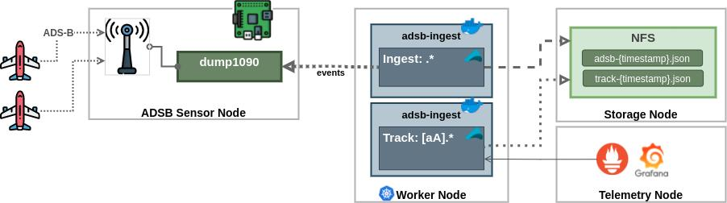

# adsb-ingest

Ingest ADSB events from __dump1090__ (Raspberry)

This reference architecture for PoC/Testing



<br>

## Ingest pipelines


### Ingest from live dump1090 to console

```
./run-ingest.sh insgest -f dump1090://rp-1:30002 --aircraft='.*' 
```

### Ingest from live dump1090 to adsb file for replays

```
./run-ingest.sh insgest -f dump1090://rp-1:30002 -o file://flight-1.adsb --output.format=adsb
```

### Replay (with correct timestamps)

```
./run-ingest.sh insgest -e adsb -f file://flight-1.adsb 
```


### Track Antonov and Airbus from live dump1090 and write to CSV file as json:

```
./run-ingest.sh -f dump1090://rp-1:30002 --aircraft='[aA].*' -o 'file://Anoton-{yyyy-MM-dd_HH:mm:ss}.json' --output.format=json
```

### Ingest pipeline: [dump1090] -> [adsb-ingest] -> [Kafka] -> [adsb-ingest] -> [Files] in CSV

```
./run-ingest.sh ingest -f dump1090://host:port -o kafka://broker:9020/events

./run-ingest.sh ingest -f kafka://broker:9020/events/group1 -o 'hive:///data/adsb/yyyy/MM/dd/flight.csv'
```


## Output Example tracking Мрія:

```
Track: ADSB_AirborneVelocity(17,5,AircraftAddress(508035,Antonov An-225 Mriya,UR-82060),8D508035990443110080024D6ED7)                                                                                            
Track: ADSB_AirbornePositionBaro(17,5,AircraftAddress(508035,Antonov An-225 Mriya,UR-82060),8D508035580F119C4E5F5922868F)                                                                                        
Track: ADSB_AirbornePositionBaro(17,5,AircraftAddress(508035,Antonov An-225 Mriya,UR-82060),8D508035580F119C365F575EB0AD)                                                                                        
Track: ADSB_AircraftIdentification(17,5,AircraftAddress(508035,Antonov An-225 Mriya,UR-82060),4,0,UR82060,8D50803520552E32C36C202666C4)                                                                          
Track: ADSB_AirborneVelocity(17,5,AircraftAddress(508035,Antonov An-225 Mriya,UR-82060),8D50803599042C9DA80402F1749F)                                                                                            
Track: ADSB_AirbornePositionBaro(17,5,AircraftAddress(508035,Antonov An-225 Mriya,UR-82060),8D508035580F250B5E3448100038)                                                                                        
Track: ADSB_AirbornePositionBaro(17,5,AircraftAddress(508035,Antonov An-225 Mriya,UR-82060),8D508035580F219A8A5F31DEE302)                                                                                        
Track: ADSB_AircraftIdentification(17,5,AircraftAddress(508035,Antonov An-225 Mriya,UR-82060),4,0,UR82060,8D50803520552E32C36C202666C4)  
```

## Telemetry

Telemetry Coutners in Prometheus


----


## Resources

Raspberry Pie: [http://www.satsignal.eu/raspberry-pi/dump1090.html](http://www.satsignal.eu/raspberry-pi/dump1090.html)
ADSB Antenna: [http://www.lll.lu/~edward/edward/adsb/antenna/ADSBantenna.html](http://www.lll.lu/~edward/edward/adsb/antenna/ADSBantenna.html)
OpenSkyNetwork: [https://github.com/openskynetwork/raspberry-pi-adsb](https://github.com/openskynetwork/raspberry-pi-adsb)
dump1090: [https://github.com/antirez/dump1090](https://github.com/antirez/dump1090)


