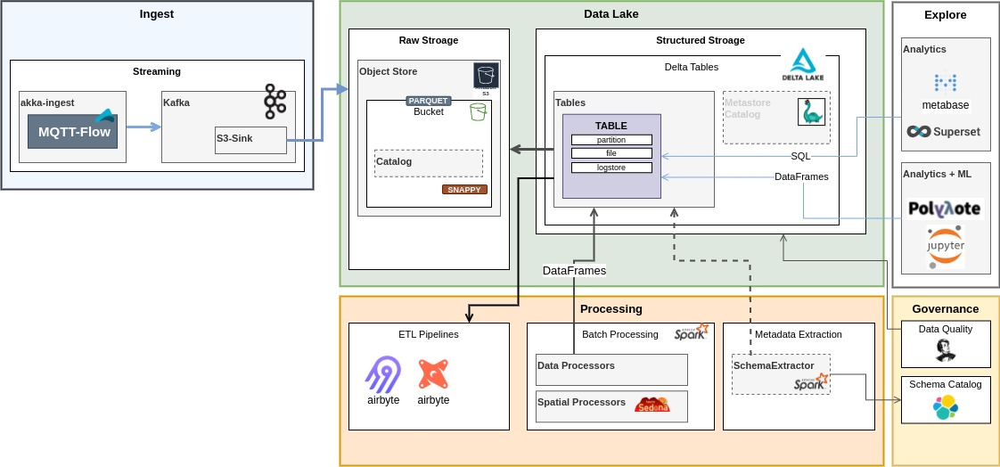

# Data

1. [data](data) - DB Dump files

## Lake

Reference Architecture for DataLake Concept based on Deltalake Store

 

----

## Resources and Credits

1. Flightaware: [https://github.com/flightaware/dump1090/blob/master/tools/README.aircraft-db.md](https://github.com/flightaware/dump1090/blob/master/tools/README.aircraft-db.md)

